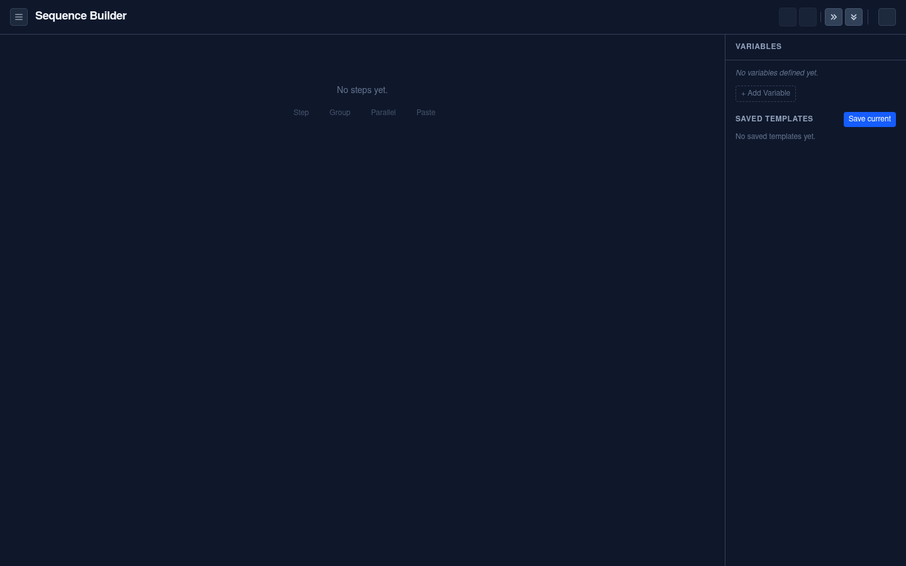
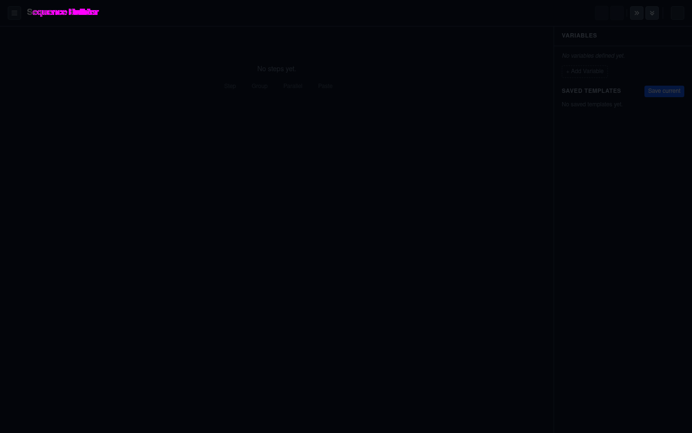

# M1 — the mux-magic token swap, measured

**Date:** 2026-07-29
**Branch:** `mux-magic@feat/charcuterie-tokens` — **not merged**, held until
`@charcuterie/tokens` publishes (see [Why the branch is held](#why-the-branch-is-held)).

M1's stated proof, from the plan:

> `mux-magic/packages/web/src/styles/tailwindStyles.css` swaps its hardcoded
> `#0f172a`/`#f1f5f9` for `@import "@charcuterie/tokens/theme.css"`, **looks identical**,
> then **gains a working non-white light mode from one attribute**.

The first half holds and is measured below. **The second half is real work, not a free
attribute flip** — mux-magic has 1,401 hardcoded palette utilities that paint over the one
rule the swap tokenises. Light mode across the fleet is a goal of this whole effort and it
*is* coming; what M1 establishes is that it arrives with the M6 consumer migration rather
than with the token layer. Sizing that job now is cheaper than discovering it at M6.

---

## Result 1 — dark is unchanged: 99.91% pixel-identical

Sequence Builder at 1440×900, before and after, same route and same viewport:

| | |
| --- | --- |
| Pixels differing | **1,144 of 1,296,000 (0.09%)** |
| Where | every one of them inside the `Sequence Builder` heading |
| Everything else | byte-identical |





The diff (magenta = changed) is one word of one heading. **The cause is worth reading**,
because it is not the colour swap — see Result 3.

Reproduce with `node tools/png-diff.mjs before.png after.png diff.png` in the `agentic`
repo. It exists because this sandbox has neither ImageMagick nor PIL, and "they look the
same to me" is not a result: a swap that shifts every pixel one step in the blue channel
looks identical and is still a change worth naming.

## Result 2 — the tokens genuinely resolve

Read live off `document.documentElement` in the running app, not from the stylesheet:

```
--color-surface-base:        #131822
--color-content-primary:     #EDF0F5
--color-intent-danger-solid: #BE3241
--radius-lg:                 10px
--control-height-md:         2.5rem
body background-color:       rgb(19, 24, 34)   → #131822
```

That is a real Yarn `portal:` resolution through the package's real `exports` map — the
`@import "@charcuterie/tokens/theme.css"` line is the one under test, not a copied file.

Flipping `data-scheme` to `light` on `<html>` flips the custom properties and the `body`
rule with **zero re-render**, exactly as designed:

```
light → body bg: rgb(245, 247, 250)  → #F5F7FA
        body color: rgb(23, 29, 40)  → #171D28
```

## Result 3 — the heading moved because of a *deliberate* Tailwind override

`<h1 class="text-lg font-bold tracking-tight">`. Tailwind's `tracking-tight` utility
resolves `var(--tracking-tight)`. Tailwind's own default is `-0.025em`; `daylight` sets
`-0.01em`. The heading's letter-spacing loosened, the text got wider, and the glyphs
shifted right.

**This is the whole 0.09%.** No colour moved that wasn't meant to.

It also surfaces something the token layer was doing without saying so: `variables.css`
declares custom properties in namespaces **Tailwind v4 already owns**, so they silently
re-theme Tailwind's own utilities with no `@theme` block and no error.

| Namespace | Verdict | Consequence |
| --- | --- | --- |
| `--color-*` | the mechanism | published through `@theme` on purpose |
| `--radius-*` | intended | `rounded-lg` follows the variant |
| `--tracking-*` | intended | `tracking-tight` follows the variant |
| `--font-*`, `--font-weight-*` | intended | `font-sans` follows the variant |
| `--container-*` | **hazard — since fixed** | `max-w-md` silently became `max-w-lg` |

The first four are the point — a variant that cannot reach `rounded-lg` is not really a
visual direction. **`--container-*` is not.** Ours is a five-step container-query scale;
Tailwind's is a thirteen-step `max-w-*` scale using the same names at different sizes
(our `md` is 32rem against Tailwind's 28rem). Nothing about a *visual direction* argues
for changing what `max-w-md` means.

Pinned by `packages/tokens/src/tailwindCollisions.test.ts`, which fails if the set of
overridden namespaces changes — a new collision has to be a decision, not a side effect.
The test also records three near misses that look like collisions and aren't: Tailwind
uses `--spacing` where we use `--space-*`, `--text-*` where we use `--font-size-*`, and
`--leading-*` where we use `--line-height-*`.

**Resolved 2026-07-29 (Kevin's call): renamed.** The scale now emits as `--cq-*` and the
TS export is `containerQuery`; Tailwind's `--container-*` is left alone, so `max-w-md`
keeps meaning 28rem. Free exactly once, because nothing consumes the package yet — see
[the decision](decisions/2026-07-29-container-query-scale-is-cq-not-container.md).
`tailwindCollisions.test.ts` now asserts the emitted CSS contains no `--container-` at
all, and still pins the four remaining collisions.

## Result 4 — light mode is not achieved, and the reason is structural

Flipping `data-scheme="light"` changes `body`. It changes **nothing a user can see**:

```
after-dark vs after-light: 0 of 1,296,000 pixels differ (0.00%)
```


`body` is completely occluded. Counted in `mux-magic/packages/web/src`:

| | |
| --- | --- |
| Hardcoded `*-slate-*` utilities | **993**, across **134 files** |
| Other hardcoded palette utilities | **408** |
| `dark:` variants in the entire app | **1** |

None of this is a surprise about the app — the plan's own context section says *"no
`dark:` variants — the app is permanently dark"*. The correction is to the milestone
summary's **sequencing**, not to the goal: a working light mode needs those 1,401
utilities migrated to `bg-surface-*` / `text-content-*` / `bg-intent-*-solid`, and that
migration is M6. The token layer is what makes it a mechanical find-and-replace instead of
a redesign, which is the point of doing it first.

**What M1 actually proves** is the layer beneath it: the tokens resolve, compose, and
respond to an attribute flip in a real app, and adopting them costs a dark-mode regression
of 1,144 pixels in one heading. That is the hard part, and it is done. The measurement
above is the M6 work order — 993 `*-slate-*` utilities across 134 files — not a verdict on
whether light mode happens.

## Result 5 — a real bug in mux-magic, surfaced by the swap

`index.html` carried an anti-flash rule:

```html
<style>html, body { background-color: #0f172a; }</style>
```

That block is **unlayered**, and an unlayered rule beats anything in `@layer base`
regardless of order. Naming `body` there meant it silently outranked the themed `body`
rule — so `data-scheme="light"` left the page dark and the `body` background never came
from the stylesheet at all, before or after the swap.

Fixed by scoping it to `html` and giving it both schemes, still as literals (the whole
point is that it applies before the stylesheet defining `--color-surface-base` arrives):

```html
<style>
  html { background-color: #131822; }
  html[data-scheme="light"] { background-color: #f5f7fa; }
</style>
```

## The diff

Five lines across three files — not the four the plan predicted, and the extra ones are
informative:

1. **`packages/web/src/styles/tailwindStyles.css`** — the `@import`, and `body` reading
   `var(--color-surface-base)` / `var(--color-content-primary)`.
2. **`packages/web/index.html`** — `data-scheme` / `data-density` / `data-variant` on
   `<html>`. **Not optional:** every colour is scoped to `[data-scheme]` and every control
   size to `[data-density]`, so an `<html>` with no attributes resolves no custom
   properties at all. The app declaring its own scheme is the design — it is what makes
   flipping to `light` a one-attribute change rather than magic.
3. **`packages/web/index.html`** — the anti-flash fix above.
4. **`packages/web/package.json`** — the `portal:` dependency.

## Why the branch is held

There is no npm token in the workspace `.env`, and the plan defers publishing to a GitHub
Actions workflow. So the branch resolves the package by relative path:

```json
"@charcuterie/tokens": "portal:../../../charcuterie/packages/tokens"
```

`portal:` resolves through the package's real `exports` map, so the `@import` under test
is genuinely exercised — but a relative path breaks on any other checkout. **The branch
does not merge until `@charcuterie/tokens` publishes**, at which point the dependency
becomes an ordinary registry range and the rest of the diff is unchanged.

Note `dist/` is generated, not committed, so `yarn workspace @charcuterie/tokens build`
has to run before mux-magic's dev server. `prepack` covers this for a published package;
`portal:` does not run it.

## Reproducing

```bash
cd charcuterie && yarn install && yarn workspace @charcuterie/tokens build
cd ../mux-magic && git checkout feat/charcuterie-tokens && yarn install && yarn dev
# → http://localhost:3000/builder
```

Then in the console, to watch the attribute do the work:

```js
document.documentElement.setAttribute("data-scheme", "light")
document.documentElement.setAttribute("data-variant", "legible")
```
