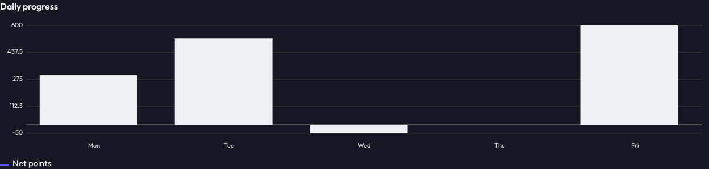
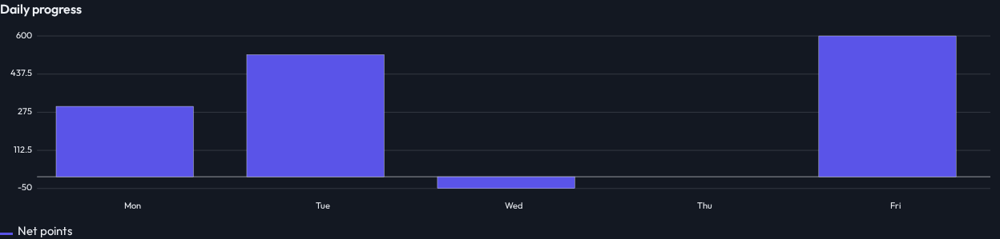

# Chart color validation visual evidence

Fixture captures reviewed for #323. The validator previously rejected configured colors and fell back to current text color. After the fix, bars use their requested series colors and match the legend. Geometry and labels remain unchanged. Eight Chart images changed intentionally; the other 900 images were unchanged.

Before:

After:

